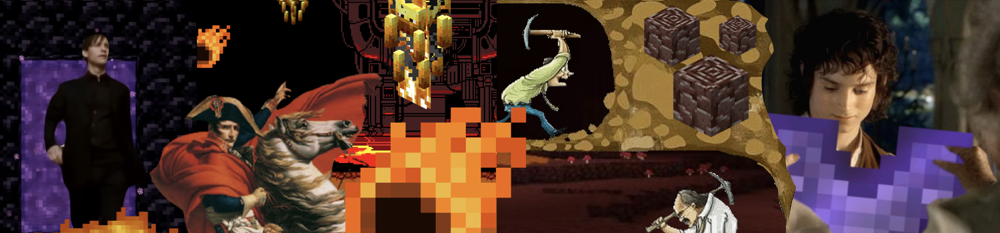
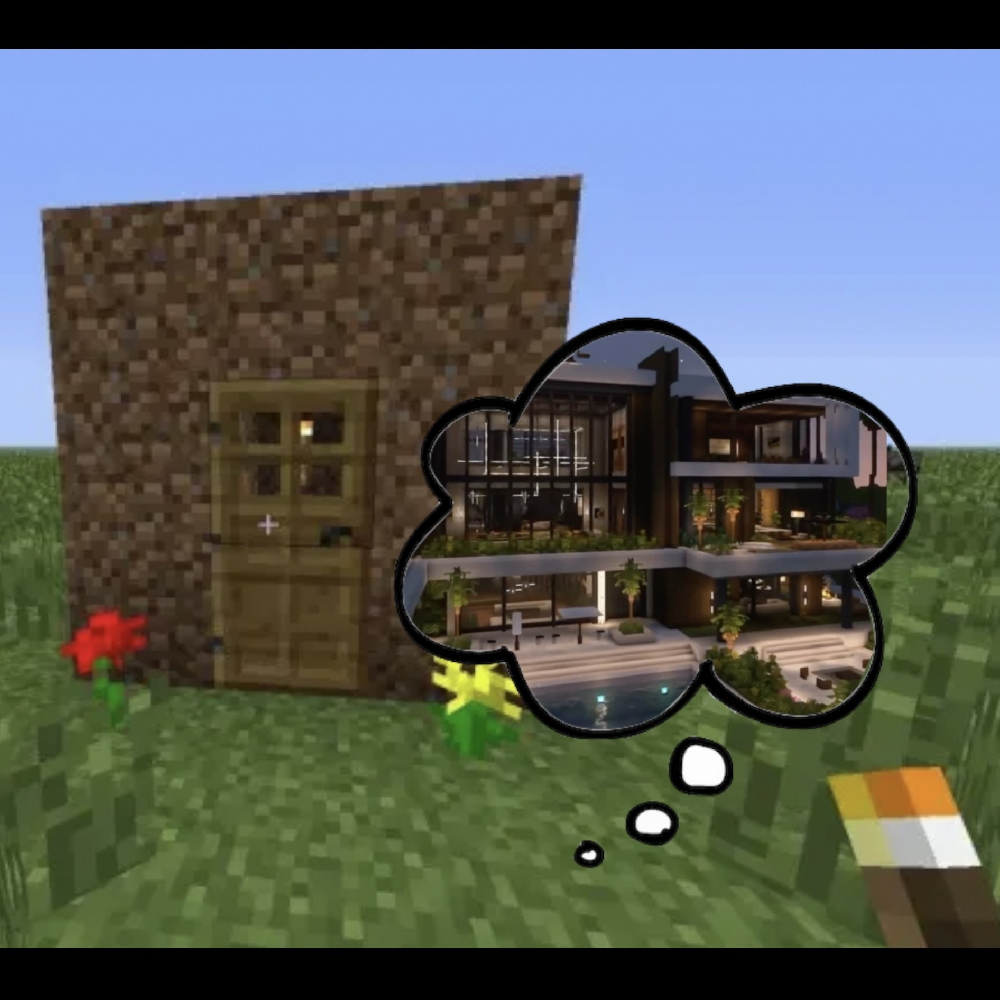

# TwoSquaredHoon

  <i>"To reach the end you must go through hell.."</i> 
  📚 Sophomore @ UW-Madison • CS

## 🏆 Featured Works
coming soon
### 

## 🛠 Technical Skills
### Languages

### Frameworks

<!-- ### DevOps & Cloud -->
### Tools

## ✨ Let's Connect
- TwoSquaredHoon@gmail.com
- [LinkedIn] (https://www.linkedin.com/in/seunghoon-lee0728)
- [Portfolio] (https://github.com/)

---

    

    

